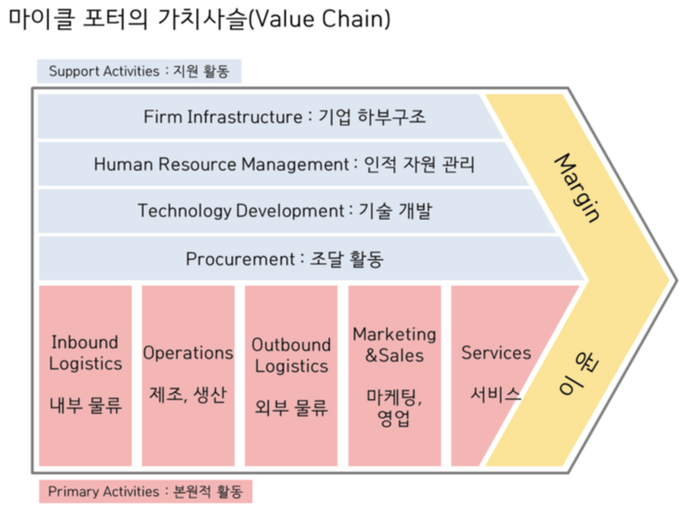

# 컨설팅 방법론

## 2019.03.09

  - 하명기 교수 (010-9779-9629)

### 컨설팅이란?

### 영업
- 제품 + 판매

### 마케팅
- 제품 + 니즈 + 표준화 + 시스템화

### 컨설턴트란?
- 문제해결 전문가

### 스키밍마켓?
  - ?

### 직장인/직업인?
  - ?

## 2019.03.16

### 클러스터
  - 우리나라에 클러스터로 OCED 지표로 평가 받는 곳은 대덕 뿐
  - 산업단지, 클러스터는 차이가 있다.
  - 클러스트를 지향하는 곳은 많다.

### 인사컨설팅
  - S-HRM 인사관리 / HRD 인사교육

### 벤치마킹
  - 벤치마킹을 할 수 있으면 좋다.
  - 아니면 벤치마킹의 대상이 되면 좋다.

### 컨설팅 노하우
  - 처음 1인 기업으로 컨설팅 시작할 때의 노하우.
  - 창업컨설팅 시 1차로 100만원에 전략 컨설팅을 해준다.
  - 2차로 실행컨설팅을 3가지 옵션 정도 제공한다.
    - A : 5천만원/5개월
    - B : 지분 10%
    - C : 매출의 퍼센티지를 가져간다.
  - 보통 사후 관리를 하지 않지만 하는 것이 좋다.
  - 전략 컨설팅은 길면 환경이 변하기 때문에 3개월 등으로 짧게 한다.
    - 환경 분석을 컨설팅 기간 내내 하는 경우도 있다.
  - 교수님은 컴퍼니빌딩 같은 역할을 수행.

논리력 | 분석력
---- | ---
통찰력 | 직관력

### 브랜딩 방법
  - 프레임워크를 만들어서 숙지한다.
  - 개인의 아이디어로 브랜딩을 한다. (ex. 1페이지로 완성하는 사업계획서)

## 2019.03.23

  - 캡슐 화장품
    - 캡슐 알약에서 착안

  - 업의 본질을 파악해야 to-be를 알 수 있다.
    - 도로교통공사
      - 지출은 건설
      - 수익은 통행료
      - 결국 to-be 는 서비스기업

## 2019.03.30

hw(급여)
a     | to-be
------|----
as-is | 

## 2019.04.13

컨설팅시 분석 이전에 상담을 먼저

### 2019.04.20

컨설팅 방법론 다음 주 시험시간 40분 + 나머지 보강
시험 문제는 공개 안하기로 함.
출석 불러서 화장실 갔다했으니 찾아 가서 확인 바람.

### 2019.04.27
  - 상공회의소를 공략해서 강의 자리를 알아보자
  - 전화나 메일보다 팩스를 보내는게 먹힌다!