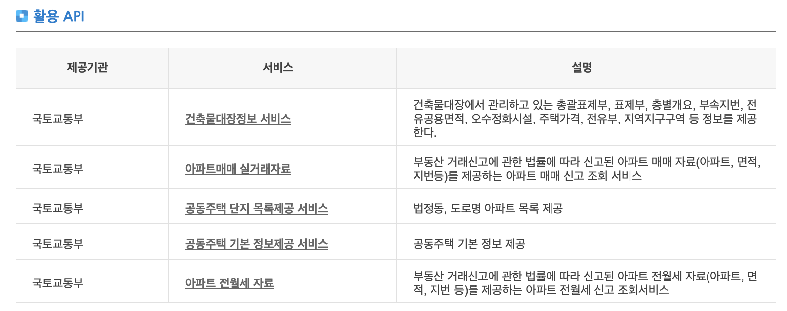

## 부동산 관련 공공 API

### 토지이용규제정보서비스 (공공)
  - http://luris.molit.go.kr/web/index.jsp

### 토지 이용 계획 API
  - https://www.data.go.kr/dataset/15012633/openapi.do

### 토지 이용 규제 API
  - https://www.data.go.kr/dataset/15021560/openapi.do

### 공공데이터 활용사례

#### 건축법과 건축정보 (안드로이드앱)
  - https://www.data.go.kr/useCase/1005583/exam.do

#### 하우빌드
  - https://www.data.go.kr/useCase/1013648/exam.do
  - 건축 플래폼 (유사)

#### 한눈에 부동산 빅데이터
  - https://www.data.go.kr/useCase/1009356/exam.do

#### 다음 부동산
 - https://www.data.go.kr/useCase/1005523/exam.do
 

#### 카카오 API
네이티브 앱 키
7186749b81b65e626e0c2e41926949ce
REST API 키
ef1da2c12cb3824dac99435cd1c4a666
JavaScript 키
a5b84d6fef74caa2180d405bc0e92dd0
Admin 키
f6d1e36aaf51fccb5b13d1251858df35

### 공시지가

  - CSV 파일 다운로드
    - 국토교통부 주택 공시가격 정보 (https://www.data.go.kr/dataset/3073746/fileData.do)
    - 연도별 파일 다운로드 가능 (text 약 1.8GB)
    - 아파트 동호수 별로 가격 확인 가능
    - 
